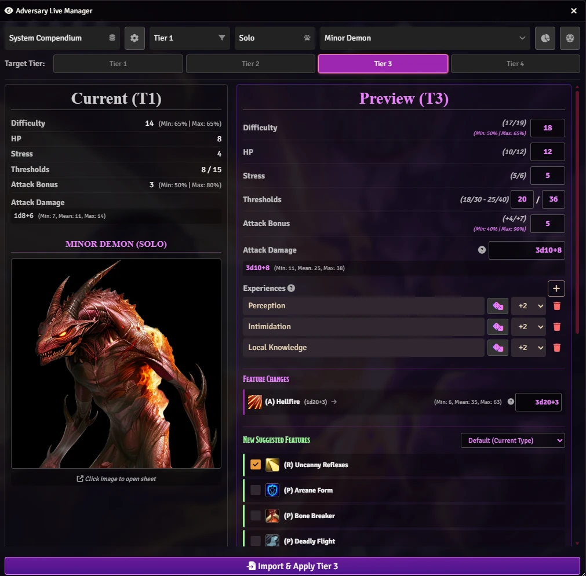
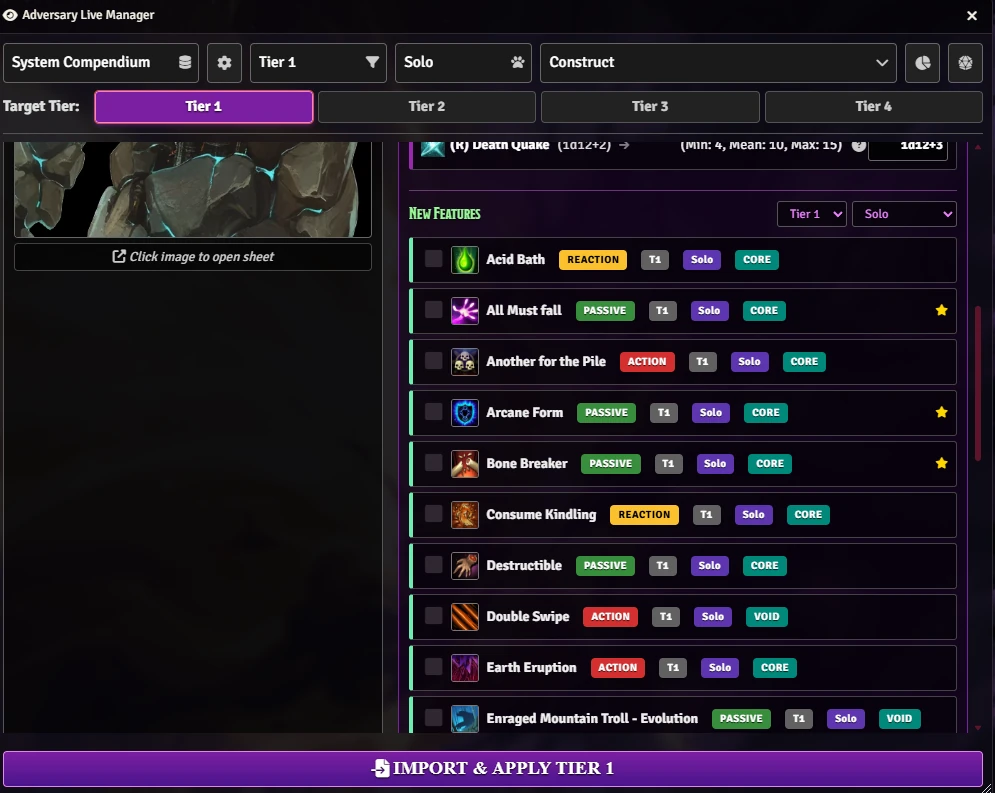
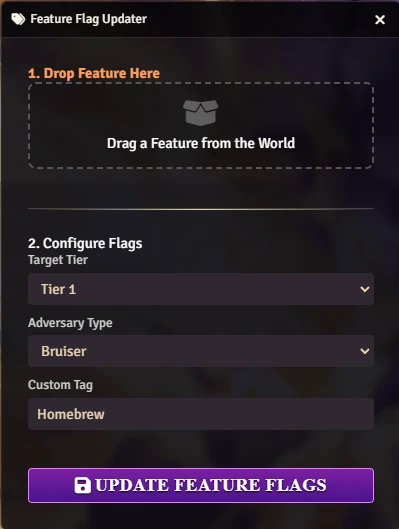
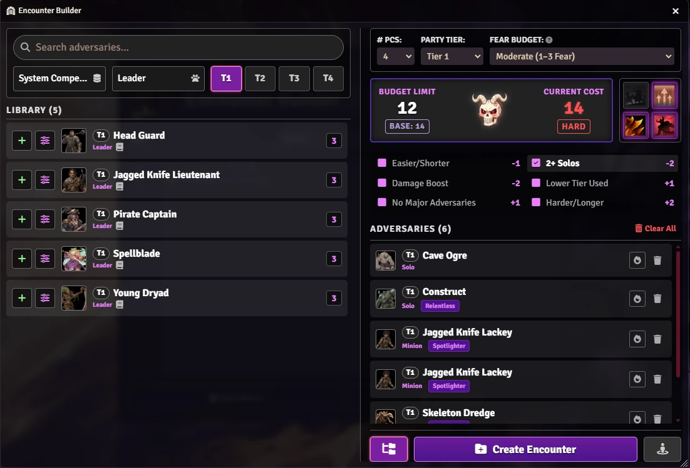
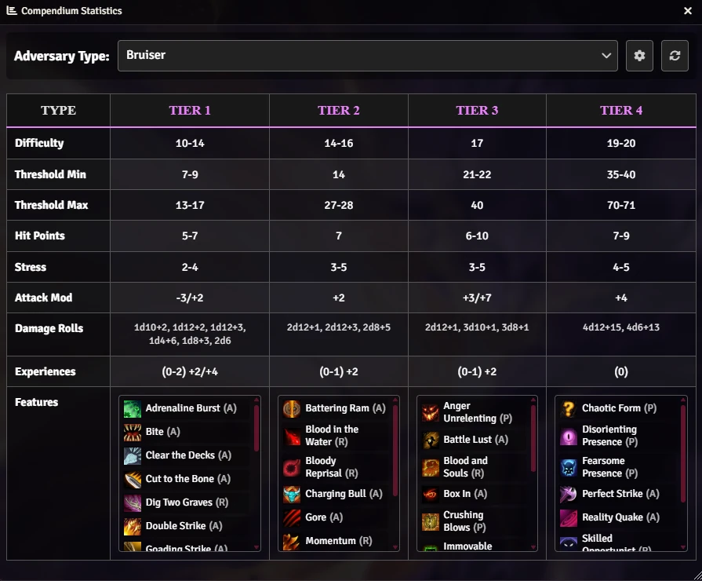
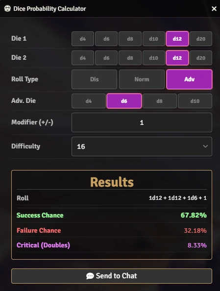

# 💀 Adversary Manager 💀
**for Daggerheart**

<p align="center"></p>

The ultimate GM companion for **Daggerheart** in Foundry VTT. Scale adversaries instantly, build balanced encounters.

<video src="[https://github.com/user-attachments/assets/a875027b-eb4a-4637-a4f5-7c61064da22d](https://github.com/user-attachments/assets/a875027b-eb4a-4637-a4f5-7c61064da22d)" 
       controls 
       width="720"
       autoplay 
       loop 
       muted></video>

## 🌟 Overview & Features

### 🛠️ Adversary Scaling & Management

<p align="center"></p>

<p align="center"></p>

* **📈 Instant Tier Scaling:** Effortlessly scale any Adversary from Tier 1 to 4 using benchmarks.
* **👀 Live Preview Dashboard:** Compare "Current" stats vs. "Target Tier" stats side-by-side before applying any changes.
* **🎲 Smart Math & Probabilities:**
    * Automatically recalculates HP, Stress, Difficulty, and Damage Thresholds.
    * Scales Attack modifiers and Damage formulas.
* **✨ Feature Automation:**
    * Auto-updates Experience values based on Tier difference.
    * Suggests appropriate **Features** (e.g., *Relentless*, *Momentum*) for the target Tier.
* **🔧 Manual Overrides:** Full control to manually tweak any specific stat (HP, Damage, etc) directly in the preview window.
* **📦 Batch & Compendium Support:**
    * Update multiple selected tokens on the canvas simultaneously.
    * Import and auto-scale adversaries directly from Compendiums into your world.

### 🏷️ Feature Management

<p align="center"></p>

* **Add your Homebrew:** You can add your homebrew features to the manager.
* **Feature Flag Updater:** A drag-and-drop utility to manually configure scaling metadata (Tier, Adversary Type, Custom Tag) for feature items in your world.
* **Import all Features:** You can import all features directly from adversaries in a compendium.

### ⚔️ Encounter Builder

<p align="center"></p>

* **🔎 Search & Library:** Robust search across World actors and System Compendiums with filters for Tier and Type.
* **🧮 Smart Budgeting:** Automatic **Battle Point (BP)** calculation based on Party Size and Tier. Tracks current cost vs budget limit.
* **🧠 Synergy & Role Detection:** Automatically detects tactical roles like **Summoner**, **Spotlighter**, **Momentum/Terrifying**, and **Relentless**, adjusting the difficulty estimate based on enemy combinations.
* **💀 Difficulty Estimator:** Real-time difficulty assessment (Balanced, Challenging, Deadly, Out of Tier).
* **🔥 Custom Modifiers:** Apply **Damage Boosts** to specific units or toggle manual difficulty modifiers (Easier/Harder) to fine-tune the challenge.
* **⚡ Quick Deployment:** Build your encounter list and **place tokens directly on the scene** (hidden by default) or organize them into folders.

### 📊 Compendium Statistics

<p align="center"></p>

* **🔍 Stats Explorer:** Browse comprehensive statistics for every adversary type across all 4 Tiers.
* **📋 Data Tables:** View calculated ranges for Difficulty, HP, Stress, Thresholds, Attack Modifiers, and Damage Rolls.
* **🧩 Feature Browser:** See a list of all features found in the compendium for each Tier.
* **🖐️ Drag & Drop:** Click to view feature details or **drag them directly onto an actor sheet**.
* **📦 Add your Compendium:** You can add more compendiuns.

### 🎲 Dice Probability Calculator

<p align="center"></p>

* **Live Analysis:** Instantly calculate success, failure, and critical hit chances for Duality Dice rolls.
* **Flexible Options:** Supports Advantage, Disadvantage, and flat numerical modifiers.
* **Chat Integration:** Send detailed probability result cards to the chat log.

## ⚙️ Usage

Access all functions (Adversary Manager, Encounter Builder, Compendium Stats, and Dice Probability) by clicking the buttons in the Daggerheart System Menu or Actor Directory.

<p align="center"></p>

You can also use macros to access the API:

```js
// Adversary Manager (Live or Batch based on selection)
AM.Manage();
```

```js
// Encounter Builder
AM.EncounterBuilder();
```

```js
// Compendium Stats
AM.CompendiumStats();
```

```js
// Dice Probability
AM.DiceProbability();
```

## ⚙️ Instructions
[How to Import Features from an Adversary Compendium](https://github.com/brunocalado/daggerheart-advmanager/wiki/How-to-Import-Features-from-an-Adversary-Compendium).
[How to Add Your Features to the Manager
](https://github.com/brunocalado/daggerheart-advmanager/wiki/How-to-Add-Your-Features-to-the-Manager).

Learn more at [WIKI](https://github.com/brunocalado/daggerheart-advmanager/wiki).

## 🚀 Installation

Install via the Foundry VTT Module browser or use this manifest link:

```js
https://raw.githubusercontent.com/brunocalado/daggerheart-advmanager/main/module.json
```

## 📜 Changelog

You can read the full history of changes in the [CHANGELOG](CHANGELOG.md).

## ⚖️ Credits and License

* **Code License:** MIT License.
* **Assets:** AI Audio and images provided are [CC0 1.0 Universal Public Domain](https://creativecommons.org/publicdomain/zero/1.0/).

**Disclaimer:** This module is an independent creation and is not affiliated with Darrington Press.

# 🧰 My Daggerheart Modules

| Módulo | Descrição |
| :--- | :--- |
| 💀 [**Adv. Manager**](https://github.com/brunocalado/daggerheart-advmanager) | Escalone adversários e crie encontros balanceados no Foundry. |
| ☠️ [**Death Moves**](https://github.com/brunocalado/daggerheart-death-moves) | Efeitos visuais e sonoros imersivos para o momento da morte. |
| 📏 [**Distances**](https://github.com/brunocalado/daggerheart-distances) | Visualização de alcances de combate com anéis e cálculos. |
| 🤖 [**Fear Macros**](https://github.com/brunocalado/daggerheart-fear-macros) | Automação de macros baseada no recurso Fear. |
| 😱 [**Fear Tracker**](https://github.com/brunocalado/daggerheart-fear-tracker) | Slider animado e configurável para controle de Fear na UI. |
| 🛒 [**Store**](https://github.com/brunocalado/daggerheart-store) | Loja dinâmica e interativa totalmente configurável. |
| 📦 [**Extra Content**](https://github.com/brunocalado/daggerheart-extra-content) | Coleção de recursos diversos para o sistema. |
| 📜 [**Quick Rules**](https://github.com/brunocalado/daggerheart-quickrules) | Guia de referência rápida para as regras centrais. |

# 🗺️ Adventures

| Aventura | Descrição |
| :--- | :--- |
| ✨ [**I Wish**](https://github.com/brunocalado/i-wish-daggerheart-adventure) | Um mercador amaldiçoado busca sua última esperança em uma expedição. |
| 💣 [**Suicide Squad**](https://github.com/brunocalado/suicide-squad-daggerheart-adventure) | Criminosos forçados a servir um mestre em uma terra à beira da guerra. |