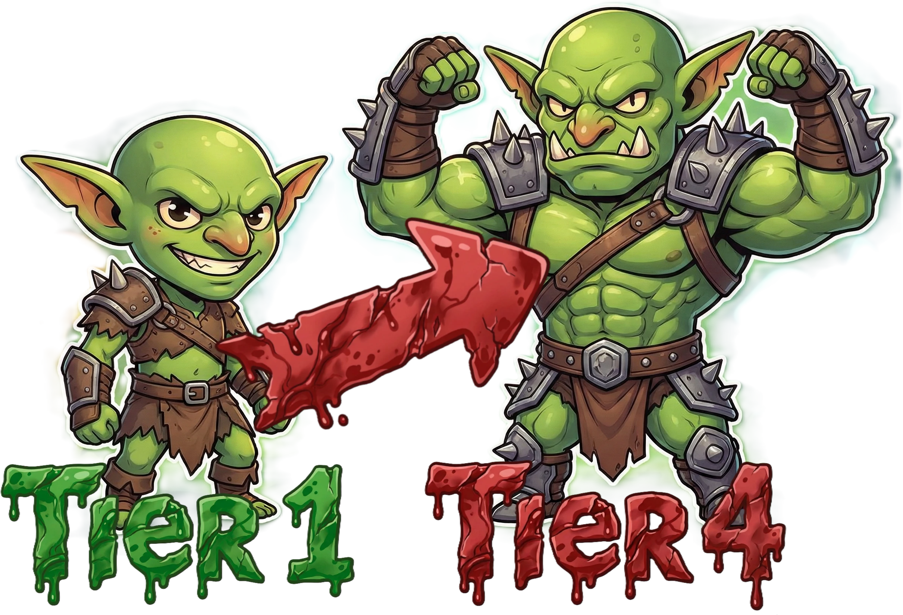
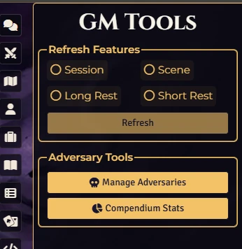

# 💀 Adversary Manager 💀
**for Daggerheart**

An essential GM tool for **Daggerheart** in Foundry VTT. Instantly scale adversaries across Tiers, manage their stats, and preview changes with a powerful live dashboard.

<video src="https://github.com/user-attachments/assets/a875027b-eb4a-4637-a4f5-7c61064da22d" 
       controls 
       width="720"
       autoplay 
       loop 
       muted></video>

## 🌟 Overview & Features

### 🛠️ Adversary Scaling & Management

* **📈 Instant Tier Scaling:** Effortlessly scale any Adversary (Standard, Minion, Horde, Solo, etc.) from Tier 1 to 4 using official benchmarks.
* **👀 Live Preview Dashboard:** Compare "Current" stats vs. "Target Tier" stats side-by-side before applying any changes.
* **🎲 Smart Math & Probabilities:**
    * Automatically recalculates HP, Stress, Difficulty, and Damage Thresholds.
    * Scales Attack modifiers and Damage formulas (including Halved Damage for Hordes).
    * **Hit Chance Calculator:** Displays the probability of the Adversary hitting a PC (and vice-versa) based on Tier rules.
* **✨ Feature Automation:**
    * Auto-updates Experience values based on Tier difference.
    * Suggests and adds new **Features** (e.g., *Relentless*, *Momentum*) appropriate for the target Tier.
    * Allows manual selection/deselection of features via checkboxes.
* **🔧 Manual Overrides:** Full control to manually tweak any specific stat (HP, Damage, Name) directly in the preview window before confirming.
* **📦 Batch & Compendium Support:**
    * Update multiple selected tokens on the canvas simultaneously.
    * Import and auto-scale adversaries directly from Compendiums into your world.

## ⚙️ Instructions & Usage

1.  **Select a Token** (or multiple) on the canvas.
2.  Click the **"Manage Adversaries"** button in the Daggerheart side menu or Token HUD.
3.  Choose your **Target Tier** (1, 2, 3, or 4).
4.  Review the changes in the **Live Preview**.
    * *Optional:* Adjust stats manually or check/uncheck suggested features.
5.  Click **Apply** to update the actor.

## 🚀 Installation

Install via the Foundry VTT Module browser or use this manifest link:

* `https://raw.githubusercontent.com/brunocalado/daggerheart-advmanager/main/module.json`

## ⚖️ Credits and License

* **Code License:** MIT License.
* **Assets:** AI Audio and images provided are [CC0 1.0 Universal Public Domain](https://creativecommons.org/publicdomain/zero/1.0/).

**Disclaimer:** This module is an independent creation and is not affiliated with Darrington Press.

## 🧰 My Daggerheart Modules

### 🛒 [daggerheart-store](https://github.com/brunocalado/daggerheart-store)

> A dynamic, interactive, and fully configurable store for the Daggerheart system in Foundry VTT.

### 💀 [daggerheart-advmanager](https://github.com/brunocalado/daggerheart-advmanager)

> The best way to scale and manage your adversaries.

### 📦 [daggerheart-extra-content](https://github.com/brunocalado/daggerheart-extra-content)

> Resources for Daggerheart

### 📏 [daggerheart-distances](https://github.com/brunocalado/daggerheart-distances)

> Visualizes Daggerheart combat ranges with customizable rings and hover distance calculations.

### 😱 [daggerheart-fear-tracker](https://github.com/brunocalado/daggerheart-fear-tracker)

> Adds an animated slider bar with configurable fear tokens to the UI.

### 💀 [daggerheart-death-moves](https://github.com/brunocalado/daggerheart-death-moves)

> Enhances the Death Move moment with immersive audio and visual effects.

### 🤖 [daggerheart-fear-macros](https://github.com/brunocalado/daggerheart-fear-macros)

> Automatically executes macros when the Daggerheart Fear resource is changed.